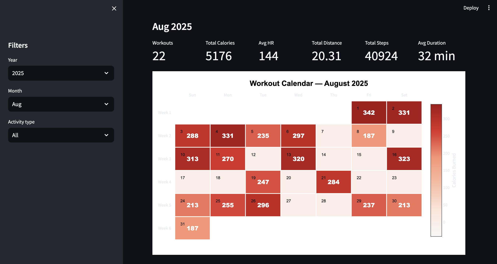
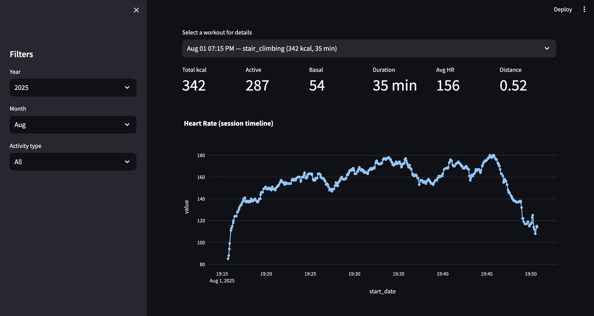

# Apple Fitness Dashboard

A comprehensive Streamlit dashboard for analyzing Apple Fitness workout data with interactive visualizations and detailed workout insights.

## Features

- **Calendar Heatmap**: Visual representation of daily calorie burn with color-coded intensity
- **Workout Metrics**: Summary statistics including total calories, average heart rate, distance, and steps
- **Interactive Filtering**: Filter by year, month, and activity type
- **Detailed Analysis**: Scatter plots showing calories vs duration with heart rate sizing
- **Calorie Breakdown**: Active vs basal calorie comparison for each workout
- **Individual Workout Details**: Drill down into specific sessions with heart rate timelines

## Screenshots


*Main dashboard with calendar heatmap and key metrics*


*Individual workout analysis with heart rate timeline*

## Installation

1. Clone the repository:
```bash
git clone https://github.com/yourusername/Apple-Fitness-Dashboard.git
cd Apple-Fitness-Dashboard
```

2. Install dependencies:
```bash
pip install -r requirements.txt
```

3. Prepare your data:
   - Export your Apple Fitness data (see [Data Export Guide](#data-export))
   - Place `filtered_records.csv` and `filtered_workouts.csv` in the project root

4. Run the dashboard:
```bash
streamlit run app.py
```

## Data Export

To get your Apple Fitness data:

1. Open the Health app on your iPhone
2. Tap your profile picture in the top right
3. Scroll down and tap "Export All Health Data"
4. Process the exported XML file to create the required CSV files:
   - `filtered_records.csv` - Individual workout metrics
   - `filtered_workouts.csv` - Workout session information

### Required CSV Columns

**filtered_records.csv:**
- `start_date`, `end_date`, `workout_id`, `metric`, `value`

**filtered_workouts.csv:**
- `workout_id`, `start_date`, `end_date`, `activity_type`, `duration`

## Project Structure

```
Apple-Fitness-Dashboard/
├── app.py                 # Main Streamlit application
├── data_processing.py     # Data loading and processing functions
├── visualizations.py     # Chart and visualization functions
├── requirements.txt       # Python dependencies
├── README.md             # This file
└── screenshots/          # Dashboard screenshots
```

## Usage

1. **Select Filters**: Use the sidebar to choose year, month, and activity type
2. **View Overview**: Check the top metrics for quick insights
3. **Explore Calendar**: See daily workout intensity in the heatmap
4. **Analyze Trends**: Review the calories vs duration scatter plot
5. **Dive Deep**: Select individual workouts for detailed heart rate analysis

## Technologies Used

- **Streamlit** - Web application framework
- **Plotly** - Interactive visualizations
- **Pandas** - Data manipulation and analysis
- **NumPy** - Numerical computing


## Acknowledgments

- Apple Health for providing comprehensive fitness data
- Streamlit community for excellent documentation and examples
- Plotly for powerful visualization capabilities
